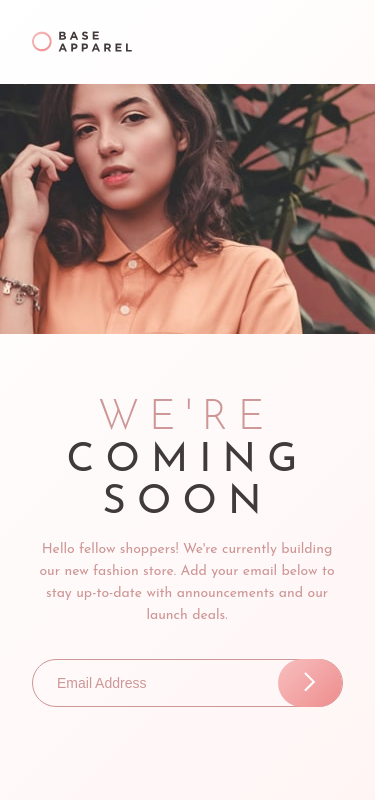
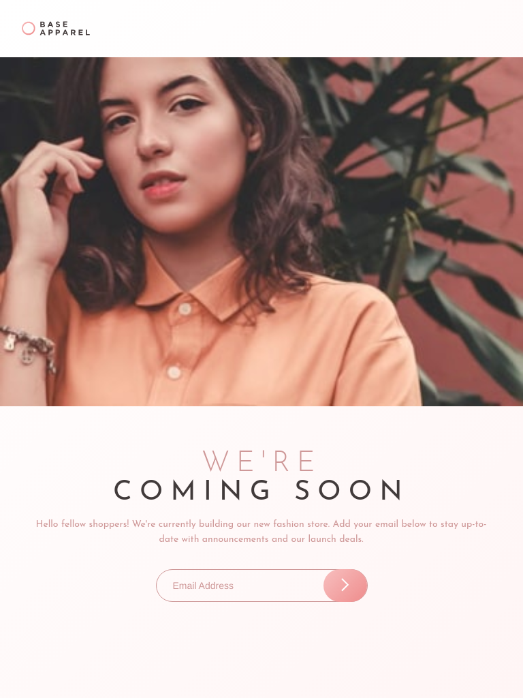
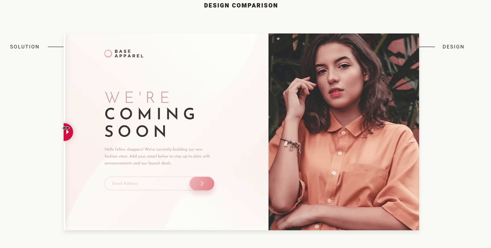
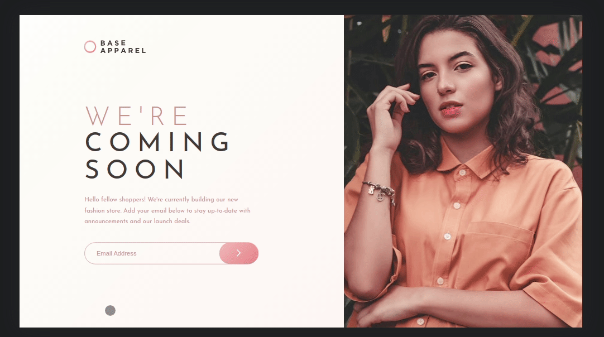

# Frontend Mentor - Base Apparel coming soon page solution

This is a solution to the [Base Apparel coming soon page challenge on Frontend Mentor](https://www.frontendmentor.io/challenges/base-apparel-coming-soon-page-5d46b47f8db8a7063f9331a0). Frontend Mentor challenges help you improve your coding skills by building realistic projects.

## Table of contents

- [Overview](#overview)
  - [The challenge](#the-challenge)
  - [Screenshot](#screenshot)
  - [Links](#links)
- [My process](#my-process)
  - [Built with](#built-with)
  - [What I learned](#what-i-learned)
  - [Useful resources](#useful-resources)
- [Author](#author)

## Overview

This is the front-end mentor's fifteen challenge. The challenge is to build the "Base Apparel coming soon" and make it as close to the design as possible. Building the desing with whatever you want to finish, any language, framework or tools.

### The challenge

Users should be able to:

- View the optimal layout for the site depending on their device's screen size
- See hover states for all interactive elements on the page
- Receive an error message when the `form` is submitted if:
  - The `input` field is empty
  - The email address is not formatted correctly

## Screenshot

### Mobile design

<p  align="center">
  </img>
</p>

### Tablets design

<p  align="center"></img></p>

### Desktop design

<p  align="center"></img></p>

### result of my work

<p  align="center"></img></p>
<p  align="center"></img></p>

### Links

- Solution URL: [My solution for this challenge](https://www.frontendmentor.io/solutions/single-price-grid-with-reactjs-YR5dhXAtZ)
- Live Site URL: [check the result](https://jcdmeira-base-apparel.netlify.app)
- My figma design: [Figma](https://www.figma.com/file/dnk90jvmEmbR4d63FfSy0F/15-base-apparel)

## My process

### Built with

- Mobile-first workflow
- [React](https://reactjs.org/) - JS library
- [Styled components](https://styled-components.com) - CSS in js with stiled components
- [react-toastify](https://fkhadra.github.io/react-toastify/introduction/) - toastify documentation
- [validator](https://www.npmjs.com/package/validator) - validator documentation

### What I learned

Creating forms in react has the idea that the mutable state is kept to react's state and updated by it. Therefore, react monitors and also controls the state of the form's inputs. What is called a 'controlled component'. And so it is possible to pass the state and manipulate with other pieces of code.

```JSX
import React, { useState } from 'react';
import { isEmail } from 'validator';

import arrow from '../../assets/images/icon-arrow.svg';
import { MyInput } from './style';

import error from '../../assets/images/icon-error.svg';

import { ToastContainer, toast } from 'react-toastify';
import 'react-toastify/dist/ReactToastify.css';

toast.configure();

function SendEmail() {
  const [formValues, setFormValues] = useState({});
  const [myError, setMyError] = useState(false);

  const notify = () => toast.success('Email successfully sent ');

  function handleSubmit(e) {
    e.preventDefault();

    const formData = new FormData(e.target);
    const data = Object.fromEntries(formData);
    if (data.email === '' || !isEmail(data.email)) setMyError(true);
    if (isEmail(data.email)) {
      setMyError(false);
      setFormValues({});
      notify();
    }
  }

  function handleChange(e) {
    const { name, value } = e.target;
    setFormValues({ ...formValues, [name]: value });
  }

  return (
    <>
      <MyInput myError={myError}>
        <form onSubmit={handleSubmit}>
          <input
            id="email"
            type="text"
            name="email"
            placeholder="Email Address"
            onChange={handleChange}
            value={formValues.email || ''}
          />
          <button type="submit">
            
          </button>
        </form>
        
        <span className="error">Please provide a valid email</span>
      </MyInput>
    </>
  );
}

export { SendEmail };

```

Creating a linear gradient

```JS
import styled from 'styled-components';

export const MyInput = styled.div`

  button {
    background-image: linear-gradient(135deg, #f8bfbf, #ee8c8c);
  }
`;
```

### Useful resources

- [react tutorial](https://pt-br.reactjs.org/tutorial/tutorial.html) - This helped me structure the components and build the proposed page.
- [my figma design](https://www.figma.com/file/dnk90jvmEmbR4d63FfSy0F/15-base-apparel) - My figma design for help anyone who wants to build this challenge.
- [CSS units conversor - px to VH/VW/REM](https://it-news.pw/pxtovh/) - CSS units conversor .
- [Converting Colors](https://convertingcolors.com) - HSL for all color systems.
- [CSS Gradients](https://www.w3schools.com/css/css3_gradients.asp) - gradients with css
- [Focus](https://pt.stackoverflow.com/questions/5216/como-remover-borda-dos-input-e-textarea-de-todos-os-browsers-quando-clicado) - input focus.
- [placeholder style](https://www.devmedia.com.br/placeholder-em-html5-texto-padrao-de-input/24503) - how to change the style of a placeholder
- [placeholder style 2](https://www.horadecodar.com.br/2019/07/16/como-adicionar-css-no-placeholder/) - how to change the style of a placeholder
- [Complete Forms Guide ](https://www.youtube.com/watch?v=Uv4h8IJhQUg) - React forms guide
- [react forms ](https://medium.com/@dornelasthabata/react-desenvolvendo-formulários-de-forma-prática-e1a572ee50d5) - developing forms

## Author

- Personal Page - [Jean Carlos De Meira](https://jcdmeira.github.io)
- Frontend Mentor - [@JCDMeira](https://www.frontendmentor.io/profile/JCDMeira)
- Instagram - [@jean.meira10](https://www.instagram.com/jean.meira10/)
- GitHub - [JCDMeira](https://github.com/JCDMeira)
